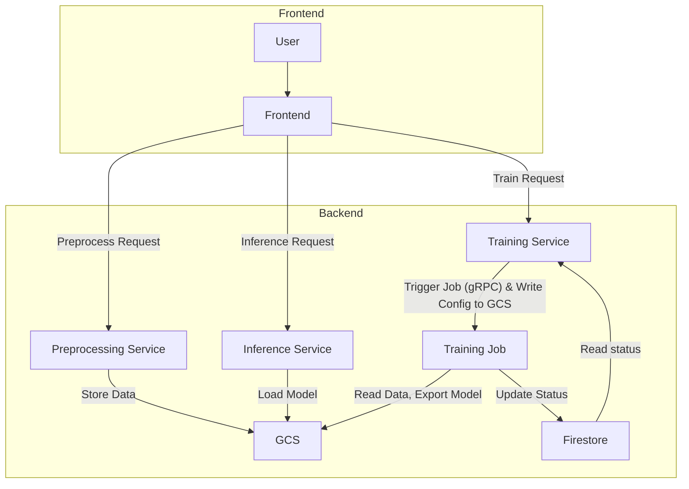

# Cloud Infrastructure for Gemma Fine-Tuning

> To be written and documented...

This project sets up cloud infra for runing fine tuning jobs on Gemma models using the Hugging Face ecosystem. We leverage GCP technologies such as Cloud Run, Cloud Storage, Firestore for a scalable and efficient system.

Jet Chiang & Adarsh Dubey -- Google Summer of Code 2025 @ Google DeepMind

## Features

- Data preprocessing (for vision and text) from custom uploaded and huggingface datasets
- Data augmentation using NLP techniques and synthetic generation using LLM
- Fine-tuning using both Huggingface or Unsloth frameworks (with 4/8 bit quantization)
- Fine-tuning with PEFT (LoRA, QLoRA), RL (GRPO, PPO, to come soon), full SFT
- Export to multiple formats (supports transformeres, vLLM, Ollama, llama.cpp, etc) to GCS or huggingface hub
- Logging integration with Weights & Biases or TensorBoard
- Evaluation and batch inference of fine tuned models

## Architecture

## Developers Notes

- Read the `README.md` in each subdirectory for more details.
- Deployment current uses `cloudbuild.yaml`, make sure you set the correct project ID with `gcloud config set project <project-id>`
- Unless you have a CUDA GPU don't try to install all packages for certain services, it will fail locally (especially on Mac), use Colab for experiments instead
