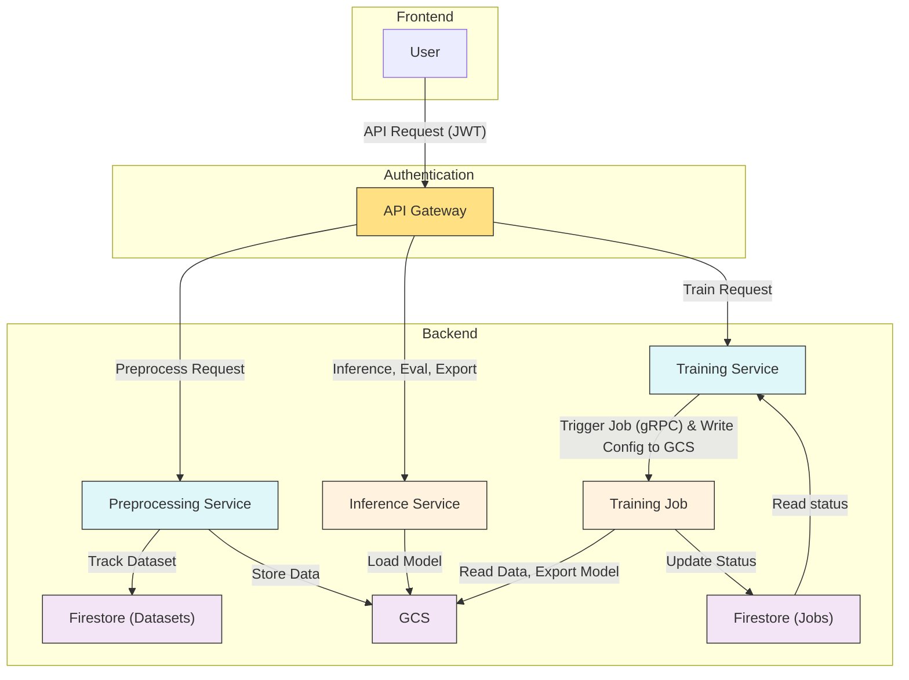

# Web Platform for Gemma 3 VLM Fine-Tuning

This project sets up cloud infrastructure on Google Cloud Platform (GCP) for managing and running fine tuning jobs on Gemma models. We use Cloud Run, Cloud Storage, Firestore, Firebase, API Gateway, and various LLM fine tuning and inference frameworks for a scalable, customizable, and efficient system. Besides accessing our service through our web platform, you can easily deploy this on your own GCP project, or use it as reference for building similar systems.

Jet Chiang (@supreme-gg-gg) & Adarsh Dubey (@inclinedadarsh) -- Google Summer of Code 2025 @ Google DeepMind

## Features

- Data preprocessing (for vision and text) from custom uploaded and huggingface datasets
- Data augmentation using NLP techniques and synthetic generation using LLM
- Fine-tuning using both Huggingface or Unsloth frameworks (with 4/8 bit quantization)
- Fine-tuning with PEFT (LoRA, QLoRA), RL (GRPO, PPO, to come soon), full SFT for various tasks like classification, text generation, reasoning, etc.
- Export to multiple formats (supports transformeres, vLLM, Ollama, llama.cpp, etc) to GCS bucket or huggingface hub
- Cloud logging integration with Weights & Biases or TensorBoard
- Task-specific evaluation suites and batch inference ("vibe check") of fine tuned models

## Coming Soon

- IaC and deployment scripts so you can run this on your own GCP project!
- More data augmentation for vision and text datasets
- Audio modality support for Gemma 3n
- Direct deployment on GCP of fine tuned model using Ollama or vLLM (one-click and ready for inference)

## Architecture

## Security & Authentication

- All API requests are authenticated via Firebase Auth (JWT) at the API Gateway layer.
- API Gateway validates the token and injects the user’s UID as an `X-User-ID` header to all backend services.
- All Cloud Run services are private and only accessible via the API Gateway.
- Each backend service trusts the `X-User-ID` header and enforces per-user data scoping (datasets, jobs, etc).
- No backend service performs token verification directly (unless running in local/dev mode).
- Firestore documents for datasets and jobs include a `user_id` field for multi-tenant isolation.

## Developers Notes

- Read the `README.md` in each subdirectory for more details.
- Deployment current uses `cloudbuild.yaml`, make sure you set the correct project ID with `gcloud config set project <project-id>`
- Unless you have a CUDA GPU don't try to install all packages for certain services, it will fail locally (especially on Mac), use Colab for experiments instead
